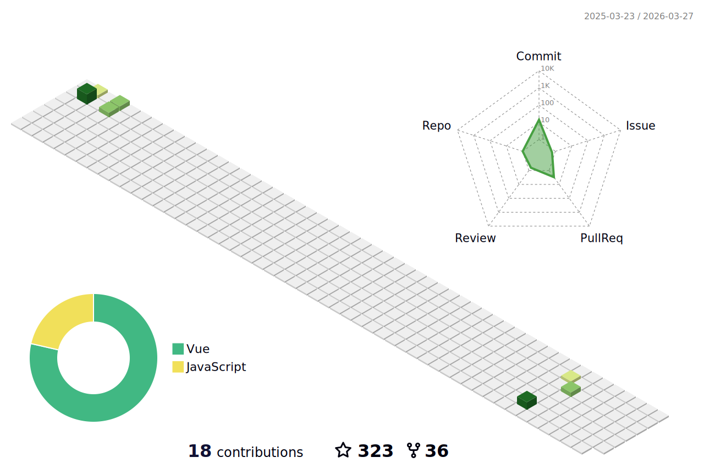

  <h1 align="center">
    <b>Hey there! I'm 大麦大麦（DaMaiCoding）👋</b>
  </h1>

  

  💻 Full-stack Software Engineer | `Nest + Vue & React`

---

### ⚡ &nbsp;GitHub Analytics

### 🛠 &nbsp;Tech Stack

### ⭐ &nbsp;Open Source

这个 `uniapp` 快速开发模板项目已经开迭代了几个月，基本上已经稳定了

而且也写了[相关的教程](https://damaicoding.github.io/uni-plus-doc/)，关于如何搭建这样的一个开发模板，连配套的创建脚手架教程也有哦~

感谢大家的支持，如果觉得不错，可以点个 `⭐star` 哦~

下面这个项目就是 `uni-plus` 的创建脚手架

如果需要创建一个项目模板脚手架项目，可以参考这个脚手架，当然，这个脚手架也是开源的

### 📈 &nbsp;Personal 3D Metrics

